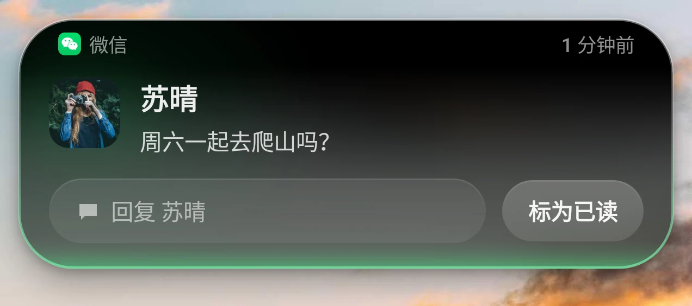
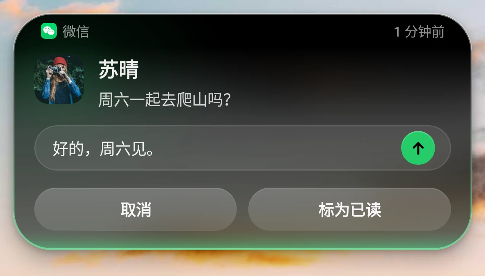
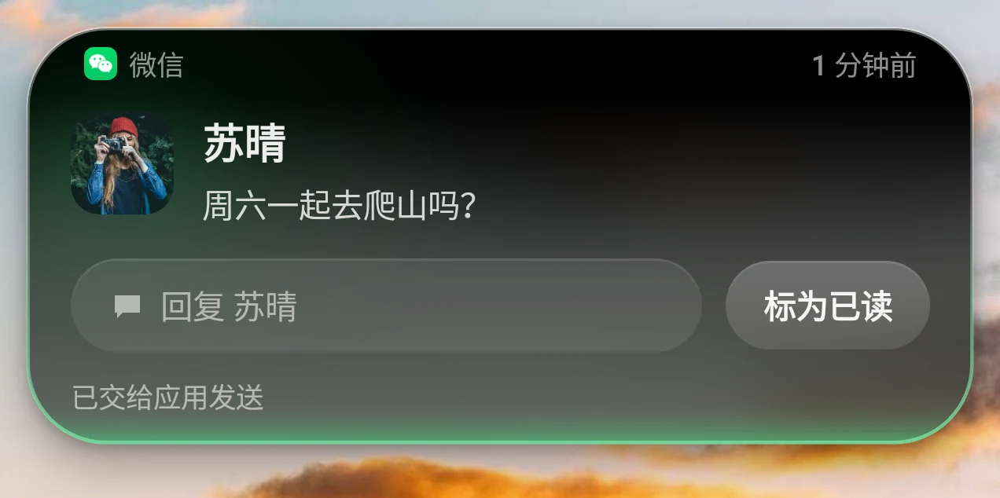

# 星河岛 SDK 0.1.1 接口说明

本文列出星河岛 SDK 0.1.1 的全部公开接口、取值范围、异常与回调，内容与工具包代码一致。

## 1. 概述

| 项目 | 内容 |
|---|---|
| 名称 | 星河岛 SDK |
| 版本 | 0.1.1 |
| 通信版本 | 7 |
| 工具包文件 | `astraisland-sdk-0.1.1.aar` |
| 公开接口所在包 | `com.astraisland.sdk` |
| 接入应用最低系统版本 | Android 8.0（API 26） |
| 宿主 | 星流（包名 `com.astraflow.tool`），需 Android 15（API 35）及以上，并已启用星河岛；仅支持通信版本 7 的星流。OPPO、一加、realme 手机上还需安装并启用星流官方插件「流体云事件接入」，星河岛方可显示 |
| 编译要求 | compileSdk 26 及以上；Java 17；Kotlin 工程需 Kotlin 2.1 及以上 |
| 依赖 | 仅 Kotlin 标准库。Kotlin 工程已自带；纯 Java 工程需添加 `implementation("org.jetbrains.kotlin:kotlin-stdlib:2.1.20")` |
| 混淆 | 无需额外混淆规则 |

星河岛 SDK 用于将应用的实时内容显示在星河岛上。一条内容（`IslandActivity`）由一个**胶囊**（收起时显示在屏幕顶部的一条）和一张**展开卡片**（用户点开胶囊后显示）组成；内容不在主岛时以**副岛**（小圆点）显示。展开卡片共九套：通用、进度、强调、明细、状态、大图、音乐、消息、对称。

`com.astraisland.protocol` 包是工具包与星流之间的通信定义，由 SDK 内部使用，接入应用无需直接调用，其内容随通信版本变化。

## 2. 接入步骤

1. 将 `astraisland-sdk-0.1.1.aar` 放入应用模块的 `libs` 目录。
2. 在应用模块的 `build.gradle.kts` 中添加依赖：

```kotlin
dependencies {
    implementation(files("libs/astraisland-sdk-0.1.1.aar"))
}
```

3. 清单无需手动修改。构建时自动合并以下声明（投送权限为普通权限，安装即授予，不弹出授权窗口）：

```xml
<uses-permission android:name="com.astraflow.tool.island.permission.PUBLISH_ACTIVITY" />
<queries>
    <package android:name="com.astraflow.tool" />
</queries>
```

4. 创建 `IslandClient`，设置回调，调用 `connect()`；状态变为 `READY` 后调用 `start()` 显示内容。

## 3. 基本流程与线程

```kotlin
val client = IslandClient(context)
client.setCallback(object : IslandCallback() {
    override fun onStateChanged(state: IslandClient.State) { /* READY 后可以显示内容 */ }
    override fun onAction(activityId: String, actionId: String) { /* 处理按钮 */ }
})
client.connect()
// 在后台线程：
val result = client.start(activity)
client.end("order-1", Outro(true, "已送达"))
client.disconnect()
```

- `connect()`、`disconnect()`、`setCallback()` 可在任意线程调用。
- `start()`、`update()`、`end()`、`endAll()`、`listMine()` 会等待星河岛处理完毕后返回，请在后台线程调用。
- 所有回调都在主线程执行。
- 星河岛重新启动后，客户端自动重新连接，状态依次变为 `WAITING`、`READY`；重新连接后请调用 `listMine()` 核对仍在显示的内容，并重新提交需要的内容。
- 同一内容编号再次 `start()` 是整份替换，不是增量更新。

## 4. 接口参考

以下签名以 Kotlin 书写；Java 中属性对应 `getXxx()` / `isXxx()`，带默认值的参数提供多个重载，工厂方法为静态方法。

### 4.1 IslandClient

```kotlin
class IslandClient(context: Context)
```

星河岛客户端。`context` 可为任意上下文，客户端只保留其应用上下文。

| 成员 | 说明 |
|---|---|
| `enum class State { NOT_INSTALLED, WAITING, REJECTED, READY }` | 连接状态，见下表 |
| `val state: State` | 当前连接状态。创建后为 `WAITING` |
| `val isReady: Boolean` | 是否已连接，可以显示内容 |
| `fun setCallback(callback: IslandCallback?)` | 设置回调；为 `null` 时不再接收回调 |
| `fun isHostInstalled(): Boolean` | 设备上是否安装了可用的星流（通信版本 7） |
| `fun connect()` | 连接星河岛。未安装可用的星流时状态变为 `NOT_INSTALLED`；否则为 `WAITING`，星河岛响应后变为 `READY`。已连接时再次调用会重新连接 |
| `fun disconnect()` | 断开连接，并结束本应用在星河岛上的全部内容 |
| `fun start(activity: IslandActivity): IslandResult` | 显示一条内容；同一内容编号已在显示时整份替换。未连接时返回 `NOT_CONNECTED` |
| `fun update(activity: IslandActivity): IslandResult` | 与 `start` 相同 |
| `fun end(id: String, outro: Outro? = null): IslandResult` | 结束一条内容，可带收尾 |
| `fun endAll(): IslandResult` | 结束本应用在星河岛上的全部内容；未连接时返回 `NOT_CONNECTED` |
| `fun listMine(): List<String>` | 本应用仍在星河岛上的内容编号（含暂未显示、排在后面的内容）；未连接时为空列表 |
| `const val SDK_VERSION: String = "0.1.1"` | 伴生常量 |
| `const val PROTOCOL_VERSION: Int = 7` | 伴生常量 |

| `State` 取值 | 含义 |
|---|---|
| `NOT_INSTALLED` | 未安装星流，或已安装的星流不支持当前通信版本 |
| `WAITING` | 正在等待星河岛响应；连接后长时间停留在此状态，说明星河岛未启用或设备尚未就绪（OPPO、一加、realme 手机上也可能是尚未启用插件「流体云事件接入」） |
| `REJECTED` | 星河岛拒绝了连接（例如身份核对未通过） |
| `READY` | 已连接，可以显示内容 |

### 4.2 IslandCallback

```kotlin
abstract class IslandCallback
```

按需重写，所有方法默认不做任何处理，都在主线程调用。事件尽力送达，不作为业务依据。

| 方法 | 触发时机 |
|---|---|
| `open fun onStateChanged(state: IslandClient.State)` | 连接状态变化 |
| `open fun onAction(activityId: String, actionId: String)` | 用户点击了卡片上的按钮。`actionId` 为应用设置的按钮编号，或 `TimerControl.actionId`、`MediaControl.actionId`、`StatusCard.ACTION_STOP` |
| `open fun onReply(activityId: String, text: String)` | 用户在消息卡片的回复输入框中发送了文字。星河岛交出文字后卡片提示「已交给应用发送」；实际发送由应用负责，发送后可用同一内容编号更新卡片 |
| `open fun onSeek(activityId: String, positionMs: Long)` | 用户在音乐卡片上拖动进度条并松手，`positionMs` 为毫秒。跳到该位置后，请用同一内容编号更新播放进度 |
| `open fun onDismissed(activityId: String)` | 用户在胶囊上划动，把这条内容从星河岛上收起。内容并未结束：有新的提醒（`setAlertOnUpdate(true)` 且内容变化）、用户进出一次本应用，或用户点击摄像头区域召回时，它会重新显示；不再需要时请调用 `end()` |
| `open fun onExpanded(activityId: String)` | 用户展开了这条内容的卡片 |
| `open fun onCollapsed(activityId: String)` | 这条内容的卡片收起 |
| `open fun onEnded(activityId: String, reason: EndReason)` | 这条内容被星河岛结束 |

```kotlin
enum class EndReason { EXPIRED, REMOVED }
```

| `EndReason` 取值 | 含义 |
|---|---|
| `EXPIRED` | 到达自动消失时间，或显示满 8 小时 |
| `REMOVED` | 用户在星流中关闭了本应用的内容或音乐内容，或星河岛停止运行 |

### 4.3 IslandResult

```kotlin
enum class IslandResult { OK, IMAGE_REJECTED, NO_PERMISSION, SOURCE_DISABLED, KIND_DISABLED, QUOTA_EXCEEDED, RATE_LIMITED, INVALID, BUSY, NOT_CONNECTED }
```

| 取值 | 含义 |
|---|---|
| `OK` | 已受理 |
| `IMAGE_REJECTED` | 已受理，但有图片不符合要求而未显示，其余内容照常显示 |
| `NO_PERMISSION` | 没有投送权限：清单中缺少 SDK 自带的权限声明 |
| `SOURCE_DISABLED` | 用户在星流中关闭了本应用的内容 |
| `KIND_DISABLED` | 用户在星流中关闭了「星河岛歌词」，音乐卡片不予显示 |
| `QUOTA_EXCEEDED` | 本应用通过 SDK 提交且尚未结束的内容已达 3 条，排队内容也计入；请先结束旧内容 |
| `RATE_LIMITED` | 提交过于频繁（每秒超过 10 次），本次未受理 |
| `INVALID` | 内容无效（例如数值不是有限数），或连接尚未就绪；原有内容保持不变 |
| `BUSY` | 星河岛暂时繁忙，本次未处理，请稍后重试 |
| `NOT_CONNECTED` | 尚未连接到星河岛，或连接已断开 |

`val accepted: Boolean`：是否已受理（`OK` 或 `IMAGE_REJECTED`）。受理不等于已显示，例如本应用在前台、排位靠后时内容暂不显示。

### 4.4 IslandActivity

```kotlin
class IslandActivity   // 通过 IslandActivity.Builder 生成
class IslandActivity.Builder(id: String, capsule: Capsule, card: IslandCard)
```

放上星河岛的一条内容。`id` 为内容编号，本应用内唯一，1 至 128 个字符（不能为空白）。

| Builder 方法 | 默认值 | 说明 |
|---|---|---|
| `setPriority(priority: Priority)` | `DEFAULT` | 排位参考。消息卡片不使用此项，按新消息排位 |
| `setAlertOnStart(alert: Boolean)` | `false` | 首次显示时自动展开卡片片刻。同一应用 10 秒内最多自动展开一次 |
| `setAlertOnUpdate(alert: Boolean)` | `false` | 更新（且内容有变化）时自动展开卡片片刻。同一应用 10 秒内最多自动展开一次；连续更新显示最新内容，期间提出的展开要求保留一次 |
| `setLockScreenVisibility(visibility: LockScreenVisibility)` | `PUBLIC` | 锁屏时显示多少 |
| `setOpenIntent(intent: PendingIntent?)` | `null` | 点击卡片时执行的操作 |
| `setOwnNotification(id: Int, tag: String? = null)` | 未设置 | 说明这条内容对应本应用自己的哪一条通知（`NotificationManager.notify` 的编号与标签）。这条内容在星河岛上时，那条通知不再单独显示在星河岛上；内容显示在主岛或副岛上，且用户开启「屏蔽系统横幅」时，那条通知也不再弹出系统横幅。仅可关联星河岛所在用户中本应用自己的通知；内容结束后不重新显示旧通知，待通知下次更新时按通知规则处理 |
| `setPostedAt(timeMillis: Long)` | 未设置 | 发送时间（`System.currentTimeMillis()` 口径，大于 0）。设置后卡片来源栏右侧显示「刚刚」「5 分钟前」或具体时刻；消息卡片以发送时间区分新消息 |
| `setStaleAt(timeMillis: Long)` | 未设置 | 过时时间（大于 0）。过了这个时间卡片注明「信息可能已过时」，内容仍保留 |
| `setDismissPolicy(policy: DismissPolicy)` | `untilEnded()` | 消失方式 |
| `setLandscapeText(text: String?)` | `null` | 横屏胶囊的完整短文字，最多 32 个字符，数字与英文按组竖排后须在四行以内；未设置或无法完整显示时，星河岛保留完整数值或短状态，不截取卡片标题。消息显示应用名称；音乐优先显示波形；空白及非文字的右侧内容保持原有形式 |
| `setAccentColor(color: Int?)` | `null` | 强调色（ARGB），用于进度条、主要按钮、放大的数值等；过暗的颜色会被提亮 |
| `setContentDescription(text: String?)` | `null` | 无障碍读屏说明，最多 256 个字符 |
| `build(): IslandActivity` | | 生成内容 |

异常：`Builder(...)` 在编号为空白或超过 128 个字符时抛出 `IllegalArgumentException`；`setPostedAt`、`setStaleAt` 在时间不大于 0 时抛出；`setLandscapeText`、`setContentDescription` 在文字为空白或超长时抛出；`build()` 在全部文字合计超过 8192 字节（UTF-8）时抛出。

只读属性：`id`、`capsule`、`card`、`priority`、`alertOnStart`、`alertOnUpdate`、`lockScreenVisibility`、`openIntent`、`notificationId: Int?`、`notificationTag: String?`、`postedAtMillis: Long?`、`staleAtMillis: Long?`、`dismissPolicy`、`landscapeText`、`accentColor`、`contentDescription`。

```kotlin
enum class Priority { LOW, DEFAULT, HIGH }
```

| 取值 | 含义 |
|---|---|
| `LOW` | 低：排在正在播放的音乐之后 |
| `DEFAULT` | 默认：按卡片种类（计时、进度、音乐等）的默认排位 |
| `HIGH` | 高：外部应用内容的最高档，与未到点的计时同档 |

```kotlin
enum class LockScreenVisibility { PUBLIC, TITLE_ONLY, HIDDEN }
```

| 取值 | 含义 |
|---|---|
| `PUBLIC` | 完整显示。设置了 `requiresUnlock` 的按钮仍在锁屏时隐藏，回复输入框锁屏时不显示 |
| `TITLE_ONLY` | 只显示标题与头像等图片：说明、正文、码、明细、比分、数值、标签、阶段名、按钮与大图均不显示 |
| `HIDDEN` | 锁屏时不显示 |

```kotlin
class DismissPolicy
  companion object {
    fun untilEnded(): DismissPolicy          // 一直显示，直到应用调用 end()；最长 8 小时
    fun afterMillis(millis: Long): DismissPolicy  // 显示后经过给定时长（大于 0，否则抛出 IllegalArgumentException）自动消失
  }
```

```kotlin
class Outro(val success: Boolean, val text: String)
```

结束内容时可选的收尾：胶囊上显示对勾（`success = true`）或叉号和一句话，约 1.6 秒后消失；只在这条内容仍在星河岛上时显示。`text` 为空白或超过 128 个字符时抛出 `IllegalArgumentException`。

### 4.5 Capsule

```kotlin
class Capsule   // 通过 Capsule.Builder 生成
class Capsule.Builder(leading: IslandImage)
```

胶囊：左侧一张图片（必填），可跟一段小标题；右侧一项信息；最右端可再固定一个小图或进度环。

| Builder 方法 | 默认值 | 说明 |
|---|---|---|
| `setLabel(label: String?)` | `null` | 左侧图片右边的小标题，最多 32 个字符 |
| `setTrailing(trailing: CapsuleTrailing?)` | `null` | 右侧信息；为 `null` 时右侧留空 |
| `setTail(tail: CapsuleTail?)` | `null` | 固定在胶囊最右端的小图或进度环；横屏时不显示 |
| `setBreathing(breathing: Boolean)` | `false` | 左侧图标做明暗呼吸变化（3 秒一轮），表示正在进行中。照片类图片不支持 |
| `setLeadingTint(color: Int?)` | `null` | 左侧内置符号的颜色（ARGB），仅对 `IslandImage.symbol` 生效 |
| `setSatellite(satellite: Satellite?)` | `null` | 副岛内容；为 `null` 时显示左侧图片 |
| `build(): Capsule` | | 照片类图片设置了呼吸变化，或非内置符号设置了颜色时抛出 `IllegalArgumentException` |

只读属性：`leading`、`leadingTint`、`breathing`、`label`、`trailing`、`tail`、`satellite`。

**CapsuleTrailing**（胶囊右侧信息，静态工厂方法；颜色为 ARGB，`null` 时使用胶囊文字颜色或强调色，过暗的颜色会被提亮）：

| 方法 | 说明 |
|---|---|
| `text(text: String, color: Int? = null)` | 文字，放不下时滚动显示，最多 512 个字符 |
| `number(text: String, color: Int? = null)` | 数字等宽显示，适合频繁变化的数值（例如「12 km」「45%」），最多 512 个字符 |
| `countdown(endAtMillis: Long, color: Int? = null)` | 倒计时，由星河岛逐秒走动，到点停在 00:00。`endAtMillis` 为结束时刻（大于 0） |
| `stopwatch(startedAtMillis: Long, color: Int? = null)` | 正计时，由星河岛逐秒走动。`startedAtMillis` 为开始时刻（大于 0） |
| `progress(fraction: Float, color: Int? = null)` | 进度环，`fraction` 为 0 至 1 |
| `busy(color: Int? = null)` | 忙碌指示：转圈的亮弧，用于没有具体进度的进行中状态 |
| `waveform(active: Boolean = true, color: Int? = null)` | 跳动线条，用于声音、通话等持续进行的活动；`active = false` 时静止 |

**CapsuleTail**（胶囊最右端，静态工厂方法）：`image(image: IslandImage)`；`progress(fraction: Float, color: Int? = null)`（`fraction` 为 0 至 1）。

**Satellite**（副岛内容，静态工厂方法）：`image(image: IslandImage)`；`progress(fraction: Float, image: IslandImage? = null, color: Int? = null)`（进度环，环中间可放一张图片）。

以上工厂方法在文字为空白或超长、时间不大于 0、比例不在 0 至 1 之间（含非有限数）时抛出 `IllegalArgumentException`。

### 4.6 IslandImage 与 BuiltinSymbol

```kotlin
class IslandImage
  companion object {
    fun picture(bitmap: Bitmap): IslandImage   // 照片类图片：头像、封面、商品图、截图，按原图显示
    fun glyph(bitmap: Bitmap): IslandImage     // 单色图标：按内置符号样式显示（卡片上带圆形浅色底，胶囊中不加描边）
    fun symbol(symbol: BuiltinSymbol): IslandImage  // 星河岛内置符号
    fun appIcon(): IslandImage                 // 本应用的桌面图标，仅用于胶囊与副岛
  }
  val isAppIcon: Boolean
  val isPicture: Boolean
```

位图须满足：未被回收；宽和高均在 1 至 2048 像素之间；占用内存（`Bitmap.getAllocationByteCount()`）不超过 8 MB（8388608 字节）。不满足时 `picture`、`glyph` 抛出 `IllegalArgumentException`。

卡片上的图片（卡片左图、头像、标题小图、进度小图、对称标志）不接受 `appIcon()`：卡片顶部的来源栏已显示应用图标与名称。

`enum class BuiltinSymbol`：`MUSIC`（音乐）、`TIMER`（计时器）、`ALARM`（闹钟）、`BATTERY`（电池）、`BOLT`（闪电）、`HEADPHONES`（耳机）、`BLUETOOTH`（蓝牙）、`MESSAGE`（消息）、`CHECK`（对勾）、`CLOSE`（叉号）、`PLAY`（播放）、`PAUSE`（暂停）、`SKIP_NEXT`（下一首）、`SKIP_PREV`（上一首）、`NAVIGATION`（方向箭头）、`HOURGLASS`（沙漏）、`INFO`（提示）、`DOWNLOAD`（下载）。

### 4.7 IslandCard（展开卡片）

```kotlin
sealed class IslandCard { abstract val title: String }
```

九种子类：`GenericCard`、`ProgressCard`、`EmphasisCard`、`DetailsCard`、`StatusCard`、`PictureCard`、`MediaCard`、`MessageCard`、`MirrorCard`，均通过各自的 `Builder` 生成。

所有卡片的共同规则：

- 卡片顶部由星河岛写上来源栏：本应用的图标与名称（名称取自系统，应用无法修改）；设置了发送时间时在来源栏右侧写出时间。
- 卡片左侧的图片只放内容自己的图片（头像、封面、商品图、符号），不接受应用图标。
- 文字长度按 UTF-16 字符计：标题最多 128 个字符，说明最多 256 个字符，正文最多 4096 个字符，其余短文字最多 32 个字符。必填文字不能为空白。
- 所有 `setXxx` 方法传入 `null` 表示不显示该项。
- 文字不合规时，对应的 `Builder` 构造方法或 `setXxx` 方法立即抛出 `IllegalArgumentException`；组合规则（按钮数量、必填项等）在 `build()` 时检查。

#### GenericCard（通用）

左侧图片，标题（右侧可放大显示一项数值或时间），说明一行，正文最多两行，底部按钮。

`GenericCard.Builder(title: String)`

| 方法 | 说明 |
|---|---|
| `setSubtitle(subtitle: String?)` | 说明，最多 256 个字符 |
| `setBody(body: String?)` | 正文，最多 4096 个字符，卡片上最多显示两行 |
| `setImage(image: IslandImage?)` | 左侧图片 |
| `setValue(value: CardValue?)` | 标题右侧放大显示的一项 |
| `setTag(tag: CardTag?)` | 说明后面的小标签 |
| `setTitleMark(mark: IslandImage?)` | 标题后面的小图（例如完成时的对勾） |
| `addButton(button: IslandButton)` / `setButtons(buttons: List<IslandButton>)` | 添加一个按钮 / 替换全部按钮；可用 `TextButton`、`IconButton`、`BarIconButton`、`ToggleButton` |
| `build(): GenericCard` | 按钮种类或数量超出上限、编号重复时抛出 `IllegalArgumentException` |

属性：`title`、`subtitle`、`body`、`image`、`value`、`tag`、`titleMark`。

**CardValue**（静态工厂方法）：`text(text: String, color: Int? = null, icon: IslandImage? = null)`（数值，最多 32 个字符；颜色为 `null` 时使用强调色，过暗的颜色会被提亮；`icon` 为数值前的小图）；`countdown(endAtMillis: Long)`；`stopwatch(startedAtMillis: Long)`。

**CardTag**：`CardTag(text: String?, icon: IslandImage? = null)`。文字最多 32 个字符；文字与图标都为 `null` 时抛出 `IllegalArgumentException`。属性：`text`、`icon`。

#### ProgressCard（进度）

左侧图片，标题（右侧自动显示百分比），说明与正文，底部一条进度条；进度条可分阶段并在下方写阶段名，也可带一个随进度移动的小图（例如骑手）。适用于外卖、打车、下载、上传等。

`ProgressCard.Builder(title: String)`

| 方法 | 说明 |
|---|---|
| `setSubtitle(subtitle: String?)` | 说明，最多 256 个字符 |
| `setBody(body: String?)` | 正文，最多 4096 个字符，卡片上显示一行 |
| `setImage(image: IslandImage?)` | 左侧图片 |
| `setProgress(fraction: Float)` | 确定的进度，0 至 1 |
| `setIndeterminate()` | 进度不确定：进度条上一段亮条来回移动 |
| `setLabels(start: String?, end: String?)` | 进度条下方左端与右端的文字，各最多 32 个字符；设置了阶段名时不可用 |
| `setStages(stages: List<String>)` | 各阶段名称，2 至 16 个（传空列表表示清除），每个最多 32 个字符。进度条按阶段数平均分段、在分界处画节点；三个以上阶段时每个名称写在对应节点下方，两个阶段时写在两端 |
| `setMarker(marker: IslandImage?)` | 随进度移动的小图（例如骑手、车辆），显示在强调色圆形底上 |
| `addButton` / `setButtons` | 可用 `TextButton`、`IconButton`、`BarIconButton`、`ToggleButton` |
| `build(): ProgressCard` | 未调用 `setProgress` 或 `setIndeterminate`；阶段名与两端文字同时设置；进度不确定时设置了阶段名；按钮超出上限时抛出 `IllegalArgumentException` |

属性：`title`、`subtitle`、`body`、`image`、`fraction: Float?`（`null` 表示进度不确定）、`startLabel`、`endLabel`、`stages: List<String>`、`marker`。

#### EmphasisCard（强调）

一张卡里最要紧的一串码或一段计时放大显示。

- 码（`EmphasisValue.code`）：标题作为上方一行小字写明是什么（例如「取件码」），码放大写在下方，说明与正文写在码下面。
- 计时（倒计时、正计时、已暂停）：左侧图片（未设置时为计时符号），标题与说明写在放大的时间上方，正文写在时间下方，右侧可放 `TimerControl` 控制按钮与圆形图标按钮。

`EmphasisCard.Builder(title: String, value: EmphasisValue)`

| 方法 | 说明 |
|---|---|
| `setSubtitle(subtitle: String?)` | 说明，最多 256 个字符 |
| `setBody(body: String?)` | 正文，最多 4096 个字符 |
| `setImage(image: IslandImage?)` | 左侧图片 |
| `addControl(control: TimerControl)` | 添加一个计时控制按钮，仅计时可用，按加入顺序排列 |
| `addButton` / `setButtons` | 可用 `TextButton`、`IconButton`、`BarIconButton`、`ToggleButton` |
| `build(): EmphasisCard` | 码设置了计时控制按钮，或按钮超出上限时抛出 `IllegalArgumentException` |

属性：`title`、`value`、`subtitle`、`body`、`image`、`controls: List<TimerControl>`。

**EmphasisValue**（静态工厂方法）：`code(text: String)`（最多 32 个字符）；`countdown(endAtMillis: Long)`（到点停在 00:00）；`stopwatch(startedAtMillis: Long)`；`paused(durationMillis: Long)`（已暂停的计时，静止显示给定时长，格式 mm:ss，满一小时为 h:mm:ss；时长不能为负数）。属性 `isTimer: Boolean`：是否为计时。

#### DetailsCard（明细）

通用卡片的排布，底部并排若干格（上方名称、下方数值），例如违章的车牌与时间、电影的场次与座位。

`DetailsCard.Builder(title: String)`

| 方法 | 说明 |
|---|---|
| `setSubtitle` / `setBody` / `setImage` | 同通用卡片 |
| `addDetail(detail: CardDetail)` / `addDetail(label: String, value: String)` | 添加一格明细 |
| `setTag(tag: CardTag?)` | 说明后面的小标签 |
| `setTitleMark(mark: IslandImage?)` | 标题后面的小图 |
| `addButton` / `setButtons` | 可用 `TextButton`、`IconButton`、`BarIconButton`、`ToggleButton` |
| `build(): DetailsCard` | 明细不在 1 至 6 格之间，或按钮超出上限时抛出 `IllegalArgumentException` |

属性：`title`、`subtitle`、`body`、`image`、`details: List<CardDetail>`、`tag`、`titleMark`。

**CardDetail**：`CardDetail(label: String, value: String)`，名称与数值各最多 32 个字符。属性：`label`、`value`。

#### StatusCard（状态）

左侧图片，标题与说明，右侧放大显示一项数值或正计时，底部可带一条电量式的水平条；正文写在下方，最多两行。适用于设备连接、运行状态等。

`StatusCard.Builder(title: String)`

| 方法 | 说明 |
|---|---|
| `setSubtitle` / `setBody` / `setImage` | 同通用卡片 |
| `setValue(value: StatusValue?)` | 右侧放大显示的一项 |
| `setLevel(level: Float?)` | 底部水平条的比例，0 至 1 |
| `setStopButton(show: Boolean)` | 显示红色停止圆钮；点击后 `onAction` 收到按钮编号 `StatusCard.ACTION_STOP`（`"stop"`） |
| `addButton` / `setButtons` | 可用 `TextButton`、`IconButton`、`BarIconButton`、`ToggleButton` |
| `build(): StatusCard` | 按钮超出上限时抛出 `IllegalArgumentException`（停止圆钮计入圆形按钮） |

属性：`title`、`subtitle`、`body`、`image`、`value`、`level: Float?`、`stopButton: Boolean`。伴生常量：`const val ACTION_STOP: String = "stop"`。

**StatusValue**（静态工厂方法）：`text(text: String)`（最多 32 个字符，例如「85%」「已连接」）；`stopwatch(startedAtMillis: Long)`。

#### PictureCard（大图）

标题与一行正文，下方一张铺满卡片宽度的大图（最高约 140dp，超出部分居中裁切）。只有一个文字按钮时，按钮显示在标题右侧。锁屏只显示标题时不显示大图。

`PictureCard.Builder(title: String, picture: IslandImage)`：`picture` 须为 `IslandImage.picture`，否则抛出 `IllegalArgumentException`。

| 方法 | 说明 |
|---|---|
| `setBody(body: String?)` | 正文，最多 4096 个字符，卡片上显示一行 |
| `addButton` / `setButtons` | 可用 `TextButton`、`BarIconButton`、`ToggleButton` |
| `build(): PictureCard` | 使用了圆形图标按钮，或按钮超出上限时抛出 `IllegalArgumentException` |

属性：`title`、`picture`、`body`。

#### MediaCard（音乐）

左侧封面，歌名与歌手，一行歌词，播放按键与进度条。进度由星河岛按播放状态与速度自行推进。播放按键排在右侧或歌词下方，由用户在星流「星河岛歌词」页选择的「音乐卡片样式」决定，应用无需处理。

`MediaCard.Builder(title: String)`：`title` 为歌名，最多 128 个字符。

| 方法 | 说明 |
|---|---|
| `setArtist(artist: String?)` | 歌手，最多 256 个字符 |
| `setCover(cover: IslandImage?)` | 封面，须为 `IslandImage.picture`；为 `null` 时显示音符占位 |
| `setPlaying(playing: Boolean)` | 是否正在播放：决定播放键的图形与进度是否走动。默认 `false` |
| `setProgress(durationMillis: Long, positionMillis: Long, atMillis: Long = System.currentTimeMillis(), speed: Float = 1f)` | 播放进度：总时长大于 0；位置在 0 至总时长之间；`atMillis` 为取得位置的时刻（大于 0）；速度在 -16 至 16 之间 |
| `setLyric(lyric: String?)` | 当前一句歌词，最多 512 个字符；为 `null` 时歌词行留空 |
| `addControl(control: MediaControl)` | 仅加入应用实际支持的播放操作；未加入的按键不可操作 |
| `setSeekable(seekable: Boolean)` | 进度条可拖动，松手位置由 `onSeek` 交给应用。须先设置播放进度 |
| `build(): MediaCard` | 可拖动但未设置播放进度时抛出 `IllegalArgumentException` |

属性：`title`、`artist`、`cover`、`playing`、`durationMillis: Long?`、`positionMillis: Long?`、`positionAtMillis: Long?`、`playbackSpeed: Float`、`lyric`、`controls: Set<MediaControl>`、`seekable`。音乐卡片不接受其他按钮。

#### MessageCard（消息）

左侧头像，发送者与最新一条消息（最多两行），可带回复输入框与按钮。消息卡片按新消息排位：刚送达时优先显示在主岛，停留一段时间后让位；设置了发送时间时，发送时间变化才算新的一条，未设置时标题或消息内容变化才算。

`MessageCard.Builder(sender: String, text: String)`：发送者最多 128 个字符；消息内容最多 4096 个字符，卡片上最多显示两行。

| 方法 | 说明 |
|---|---|
| `setAvatar(avatar: IslandImage?)` | 头像 |
| `setReplyEnabled(enabled: Boolean)` | 显示回复输入框，用户发送的文字由 `onReply` 交给应用；锁屏时不显示输入框。编辑或发送期间，新消息不替换当前回复卡片；未交给应用的文字保留为草稿 |
| `addButton` / `setButtons` | 可用 `TextButton`、`BarIconButton`、`ToggleButton` |
| `build(): MessageCard` | 使用了圆形图标按钮，或按钮超出上限时抛出 `IllegalArgumentException` |

属性：`title`（发送者）、`text`、`avatar`、`replyEnabled`。

#### MirrorCard（对称）

左右两侧各写一个名称（可带标志与小字），中间放大显示两侧的比分，下方一行写比赛信息。尚无比分时，中间放大显示 `setCenterText` 设置的文字（例如「19:30 开赛」）。卡片不显示按钮。

`MirrorCard.Builder(title: String, left: MirrorSide, right: MirrorSide)`：`title` 不单独显示在卡片上，用于无障碍读屏。

| 方法 | 说明 |
|---|---|
| `setCenterText(text: String?)` | 尚无比分时中间放大显示的文字，最多 32 个字符；设置后不显示比分 |
| `setDetail(detail: String?)` | 下方一行小字（例如赛事与比赛阶段），最多 128 个字符 |
| `build(): MirrorCard` | 未设置中间文字时两侧缺少比分，抛出 `IllegalArgumentException` |

属性：`title`、`left`、`right`、`centerText`、`detail`。

**MirrorSide**：`MirrorSide(name: String, score: String? = null, logo: IslandImage? = null, note: String? = null)`。名称、比分、小字各最多 32 个字符；`logo` 为名称上方的标志。属性：`name`、`score`、`logo`、`note`。

### 4.8 按钮

```kotlin
sealed class IslandButton(val id: String, val requiresUnlock: Boolean)
```

用户点击后，`onAction` 收到内容编号与按钮编号。`requiresUnlock = true` 时，锁屏状态下隐藏此按钮。

按钮编号：非空白，最多 64 个字符，同一张卡片内不得重复；不得使用 SDK 保留的编号 `pause`、`resume`、`stop`、`toggle`、`prev`、`play_pause`、`next`。违反时构造方法或 `build()` 抛出 `IllegalArgumentException`。

| 类 | 构造方法 | 说明 |
|---|---|---|
| `TextButton` | `TextButton(id: String, label: String, style: ButtonStyle = NORMAL, icon: IslandImage? = null, fillColor: Int? = null, requiresUnlock: Boolean = false)` | 文字按钮，可在文字前带小图标。排在卡片底部，每排两个，最多两排。`label` 最多 32 个字符。`fillColor` 为自定义底色（ARGB），仅 `NORMAL` 样式可用：不透明度过半为实心底，否则为浅色底；白色、完全透明或在深色卡片上看不清的深色按普通灰色底显示 |
| `IconButton` | `IconButton(id: String, icon: IslandImage, description: String, requiresUnlock: Boolean = false)` | 圆形图标按钮，显示在卡片第一行右侧，灰色圆形底。`description` 为读屏说明，最多 32 个字符 |
| `BarIconButton` | `BarIconButton(id: String, icon: IslandImage, description: String, requiresUnlock: Boolean = false)` | 底部图标按钮：只有图标、没有文字，在卡片底部另起一排并列显示。`description` 最多 32 个字符 |
| `ToggleButton` | `ToggleButton(id: String, label: String, checked: Boolean, icon: IslandImage? = null, requiresUnlock: Boolean = false)` | 开关按钮：在卡片底部并排成一排，打开时以强调色显示。点击后星河岛不会自行切换状态，请在 `onAction` 中处理后用同一内容编号更新 `checked` |

各类属性与构造参数同名。

```kotlin
enum class ButtonStyle { NORMAL, PRIMARY, DESTRUCTIVE }
```

`NORMAL`：灰色底；`PRIMARY`：强调色实心底，用于最主要的操作；`DESTRUCTIVE`：浅红底红字，用于删除、取消等操作。

```kotlin
enum class TimerControl(val actionId: String) { PAUSE("pause"), RESUME("resume"), STOP("stop") }
```

计时类强调卡片右侧的圆形控制按钮：`PAUSE` 暂停（强调色实心圆钮），`RESUME` 继续（强调色实心圆钮），`STOP` 结束（灰色圆钮，叉号）。

```kotlin
enum class MediaControl(val actionId: String) { PREVIOUS("prev"), PLAY_PAUSE("play_pause"), NEXT("next") }
```

音乐卡片的播放按键：上一首、播放或暂停（图形随播放状态切换）、下一首。

**数量上限（每张卡片）**：

| 种类 | 上限 |
|---|---|
| 文字按钮 `TextButton` | 4 |
| 圆形按钮（`IconButton`，以及 `TimerControl`、状态卡片停止圆钮） | 3 |
| 底部图标按钮 `BarIconButton` | 4 |
| 以上三类合计 | 4 |
| 开关按钮 `ToggleButton` | 3（另计） |

**各卡片可用的按钮**：

| 卡片 | TextButton | IconButton | BarIconButton | ToggleButton | 固定按钮 |
|---|---|---|---|---|---|
| 通用、进度、明细 | 可用 | 可用 | 可用 | 可用 | 无 |
| 强调 | 可用 | 可用 | 可用 | 可用 | `TimerControl`（仅计时） |
| 状态 | 可用 | 可用 | 可用 | 可用 | 停止圆钮 |
| 大图、消息 | 可用 | 不可用 | 可用 | 可用 | 无 |
| 音乐 | 不可用 | 不可用 | 不可用 | 不可用 | `MediaControl` |
| 对称 | 不可用 | 不可用 | 不可用 | 不可用 | 无 |

按钮的具体位置由星河岛按卡片排布决定：例如只有一个文字按钮且第一行右侧空闲时，它显示为第一行右侧的小按钮。

## 5. 限制汇总

| 项目 | 上限 |
|---|---|
| 内容编号 | 1 至 128 个字符 |
| 按钮编号 | 1 至 64 个字符，不得使用保留编号 |
| 卡片标题、发送者、歌名 | 128 个字符 |
| 说明、歌手 | 256 个字符 |
| 正文、消息内容 | 4096 个字符 |
| 歌词、胶囊右侧文字 | 512 个字符 |
| 胶囊小标题、横屏短文字 | 32 个字符 |
| 按钮文字、图标按钮说明 | 32 个字符 |
| 数值、码、明细名称与数值、标签文字、对称名称 / 比分 / 小字 / 中间文字、进度两端文字、阶段名 | 32 个字符 |
| 对称下方小字 | 128 个字符 |
| 读屏说明 | 256 个字符 |
| 收尾文字 | 128 个字符 |
| 回复输入 | 2000 个字符，输入区域最多显示三行 |
| 一条内容全部文字合计 | 8192 字节（UTF-8） |
| 明细 | 1 至 6 格 |
| 阶段名 | 2 至 16 个 |
| 位图 | 宽高 1 至 2048 像素，占用内存不超过 8 MB |
| 播放速度 | -16 至 16 |
| SDK 内容数量 | 每个应用 3 条，排队内容也计入；星河岛自行读取的同应用通知与音乐不占用此名额 |
| 提交频率 | 每个应用每秒 10 次（`start`、`update`、`end` 均计入） |
| 自动展开 | 每个应用 10 秒内 1 次 |
| 显示时长 | 由应用结束的内容最长 8 小时 |

字符数按 UTF-16 计。

## 6. 显示规则

- **通信版本**：接入库和星流必须使用通信版本 7；低于或高于 7 的版本均不建立连接。
- **内容名额**：每个应用最多保留 3 条通过 SDK 提交的内容，包括暂未显示的排队内容；星河岛自行读取的同应用通知与音乐不占用此名额。
- **连续更新**：同一事项连续更新时显示最新内容，期间提出的自动展开要求保留一次，仍受每个应用 10 秒内最多一次的限制。
- **回复保护**：编辑或发送回复期间，新消息不替换正在回复的卡片。回复只交给对应内容的发送应用；未交出的文字保留为草稿。

- **前台**：用户开启「进入对应应用时隐藏」（默认开启）时，本应用在前台期间，它的内容不在主岛和副岛上显示，离开应用后立即恢复；用户关闭此项后，内容在本应用内照常显示。应用不能更改此行为。
- **排位**：外部应用的内容最高与未到点的计时同档，排在来电、通话、刚到的新消息和导航之后。消息卡片按新消息排位，刚送达时优先显示在主岛，停留一段时间后让位。
- **内容种类**：音乐卡片属于「音乐」，消息卡片属于「消息」，强调卡片中的计时属于「计时」，其余卡片属于「实时活动」。用户在星流中关闭「星河岛歌词」后，音乐卡片的提交返回 `KIND_DISABLED`；其余种类不受星流的内容开关影响，只由「外部应用」页按应用管理。
- **外部应用**：用户可在星流「外部应用」页关闭某个应用的内容；关闭后提交返回 `SOURCE_DISABLED`，已显示的内容被结束（`onEnded` 原因为 `REMOVED`）。
- **收起与召回**：用户在胶囊上划动可把内容从星河岛上收起，应用收到 `onDismissed`，内容仍然保留，见 4.2。
- **锁屏**：见 `LockScreenVisibility`。
- **自己的通知**：仅关联当前用户中本应用自己的通知；对应内容保留期间，该通知不单独上岛。只有内容显示在主岛或副岛且开启「屏蔽系统横幅」时才屏蔽横幅。内容结束后，通知下次更新时再按通知规则处理。
- **横屏**：胶囊纵向显示，数字与英文按组排列，保留完整数值、单位或短状态，不截取卡片标题。应用可用 `setLandscapeText` 提供可在四行内完整显示的短文字；消息显示来源应用名称，音乐优先显示波形。空白、图像、计时与进度环不由该文字替换，胶囊最右端的附加图像或进度环在横屏隐藏。
- **消息更新**：设置了 `setPostedAt` 时，发送时间变化才视为新消息；未设置时，发送人或消息正文变化才视为新消息。同一消息的按钮、图片等更新不重新计算「消息主岛停留时长」。
- **音乐去重**：同一应用同时存在 SDK 音乐卡片与星河岛自行读取的音乐时，只显示 SDK 音乐卡片，另一份进入等待队列。SDK 音乐卡片的排位最高仍与未到点的计时同档。
- **内容隔离**：SDK 内容与星河岛自行读取的通知、音乐分别管理；即使内容编号相同，也不会互相替换。应用只能更新、结束自己通过 SDK 提交的内容。
- **文字长度**：SDK 按各字段上限检查文字，超长时抛出异常。星河岛接收端截短文字时保留完整字符与组合表情，不拆开肤色表情、国旗或组合表情。
- **收尾显示**：收尾仅在原内容仍保留时出现，约 1.6 秒后消失；排位最高与未到点的计时同档，并遵守原内容的锁屏可见范围与内容开关。

## 7. 示例

以下三个示例与示例工程 `app/src/main/java/com/example/islandsample/ApiExamples.kt` 一致，已编译通过。请在后台线程调用。

### 7.1 下载进度

```kotlin
fun showDownload(client: IslandClient, percent: Int): IslandResult {
    val fraction = percent / 100f
    val capsule = Capsule.Builder(IslandImage.symbol(BuiltinSymbol.DOWNLOAD))
        .setTrailing(CapsuleTrailing.progress(fraction))
        .build()
    val card = ProgressCard.Builder("正在下载离线地图")
        .setSubtitle("剩余约 2 分钟")
        .setProgress(fraction)
        .addButton(TextButton("pause_download", "暂停下载"))
        .build()
    val activity = IslandActivity.Builder("download-map", capsule, card)
        .setAccentColor(0xFF0A84FF.toInt())
        .build()
    return client.start(activity)
}
```

### 7.2 消息、短信回复与标为已读

```kotlin
fun showMessage(client: IslandClient, avatar: Bitmap, notificationId: Int): IslandResult {
    val capsule = Capsule.Builder(IslandImage.picture(avatar))
        .setLabel("小明")
        .setTrailing(CapsuleTrailing.text("晚上一起吃饭吗？"))
        .build()
    val card = MessageCard.Builder("小明", "晚上一起吃饭吗？")
        .setAvatar(IslandImage.picture(avatar))
        .setReplyEnabled(true)
        .addButton(TextButton("mark_read", "标为已读"))
        .build()
    val activity = IslandActivity.Builder("chat-xiaoming", capsule, card)
        .setPostedAt(System.currentTimeMillis())
        .setOwnNotification(notificationId)
        .setLockScreenVisibility(LockScreenVisibility.TITLE_ONLY)
        .build()
    return client.start(activity)
}
```

短信和即时消息均使用 `MessageCard`，无需另找短信模板。回复默认关闭，调用 `setReplyEnabled(true)` 开启后由星河岛显示回复输入条与发送键。「标为已读」是应用自定义的普通文字按钮，`mark_read` 是此示例的编号，不是系统保留编号。

回复内容通过回调取得；在原有 `IslandCallback` 中同时处理回复与已读操作，不要再次设置回调覆盖连接状态处理：

```kotlin
override fun onReply(activityId: String, text: String) {
    if (activityId != "chat-xiaoming") return
    // 在应用自己的后台任务中发送 text，目标为该编号对应的会话。
    // 根据实际发送结果更新会话与卡片；此回调本身不代表发送成功。
}

override fun onAction(activityId: String, actionId: String) {
    if (activityId != "chat-xiaoming" || actionId != "mark_read") return
    // 在应用中将对应会话标为已读，业务处理完成后更新或结束此内容。
    // client.update(...) 或 client.end(activityId) 必须在后台线程调用。
}
```

#### 回复界面与状态

| 状态 | 界面与处理 |
|---|---|
| 未输入 | 显示「回复 收件人」输入入口；仅有一个「标为已读」按钮时，两者并排 |
| 输入中 | 发送键位于输入条右端；「取消」与应用按钮排列在下方，不移除已读操作 |
| 正在提交 | 显示提交状态，避免重复提交；输入或提交期间不被新消息替换 |
| 已交给应用 | 显示「已交给应用发送」；实际发送及送达状态仍由应用确认 |
| 未能交给应用 | 显示「发送未完成，文字已保留。」；草稿保留，允许继续处理 |
| 锁屏 | 不显示回复输入条；需隐藏已读操作时，为按钮设置 `requiresUnlock = true` |

回复文字最多 2000 个字符，输入区域最多显示三行。空白内容不能发送。取消输入会退出编辑，未提交文字仍保留为草稿。

以下为使用当前星河岛代码生成的示例图，联系人与消息内容均为虚构，不是手机截图；具体应用仅在提供相应操作时显示回复与已读按钮。







图片素材来源与许可见 [配图说明](images/README.md)。

示例工程只展示卡片与操作回传，不发送真实短信或聊天消息。接入应用必须自行实现发送、会话已读与发送结果处理；星河岛不提供替代短信权限或聊天服务的能力。

### 7.3 倒计时

```kotlin
fun showFocusTimer(client: IslandClient, endAtMillis: Long): IslandResult {
    val capsule = Capsule.Builder(IslandImage.symbol(BuiltinSymbol.TIMER))
        .setTrailing(CapsuleTrailing.countdown(endAtMillis))
        .build()
    val card = EmphasisCard.Builder("专注", EmphasisValue.countdown(endAtMillis))
        .setSubtitle("第 2 轮")
        .addControl(TimerControl.PAUSE)
        .addControl(TimerControl.STOP)
        .build()
    val activity = IslandActivity.Builder("focus", capsule, card)
        .setAlertOnStart(true)
        .build()
    return client.start(activity)
}
```

用户点击暂停后，`onAction` 收到 `TimerControl.PAUSE.actionId`；应用暂停计时后，可用 `EmphasisValue.paused(剩余时长)` 与 `TimerControl.RESUME` 更新同一内容编号。

## 8. 示例工程

`astraisland-sdk-sample-0.1.1.zip` 为完整的 Android 示例工程：将工具包放入 `app/libs` 后即可构建。示例逐一显示九种卡片，演示各类按钮、收尾、回复、拖动进度、划走与结束回调，并附 Java 调用示例 `JavaExample.java`。
